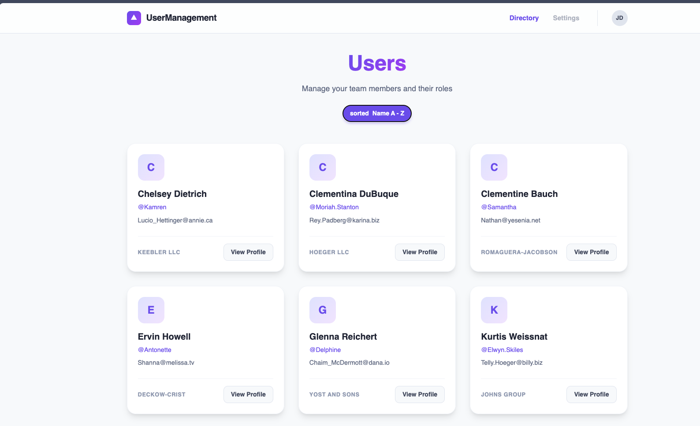

# Angular21-tanstack-query



This project was generated using [Angular CLI](https://github.com/angular/angular-cli) version 21.0.3.

## Features

### User Management Demo

A complete example of user management implemented with best practices:

- **User List**: Sortable grid layout displaying user cards with avatars.
- **Detailed View**: dedicated user profile pages with deep linking.
- **Sorting**: Client-side sorting toggle (Name A-Z).
- **Responsive Design**: Mobile-first grid layout with smooth hover effects.

### Tech Stack

- **Angular 21**: latest bleeding-edge functionality including Signals and standalone components.
- **TanStack Query**: Experimental Angular adapter for powerful server-state management.
  - Automatic background refetching
  - Loading/Error states handling
  - Request caching
- **Modern UI**:
  - Custom gradient branding
  - Interactive micro-animations
  - Glassmorphism effects
  - Responsive layout

### Project Structure

```
src/
├── app/
│   ├── users/                 # User management feature
│   │   ├── user-detail/       # User profile details component
│   │   ├── user-list/         # User grid list component
│   │   ├── user.model.ts      # TypeScript interfaces
│   │   └── users.service.ts   # HTTP data fetching service
│   ├── app.animations.ts      # Shared animations
│   ├── app.config.ts          # Dependency injection config
│   ├── app.routes.ts          # Route definitions
│   └── app.ts                 # Root component
├── main.ts                    # Application entry point
└── styles.css                 # Global styles
```

## Development server

To start a local development server, run:

```bash
ng serve
```

Once the server is running, open your browser and navigate to `http://localhost:4200/`. The application will automatically reload whenever you modify any of the source files.

## Code scaffolding

Angular CLI includes powerful code scaffolding tools. To generate a new component, run:

```bash
ng generate component component-name
```

For a complete list of available schematics (such as `components`, `directives`, or `pipes`), run:

```bash
ng generate --help
```

## Building

To build the project run:

```bash
ng build
```

This will compile your project and store the build artifacts in the `dist/` directory. By default, the production build optimizes your application for performance and speed.

## Running unit tests

To execute unit tests with the [Vitest](https://vitest.dev/) test runner, use the following command:

```bash
ng test
```

## Running end-to-end tests

For end-to-end (e2e) testing, run:

```bash
ng e2e
```

Angular CLI does not come with an end-to-end testing framework by default. You can choose one that suits your needs.

## Additional Resources

For more information on using the Angular CLI, including detailed command references, visit the [Angular CLI Overview and Command Reference](https://angular.dev/tools/cli) page.
